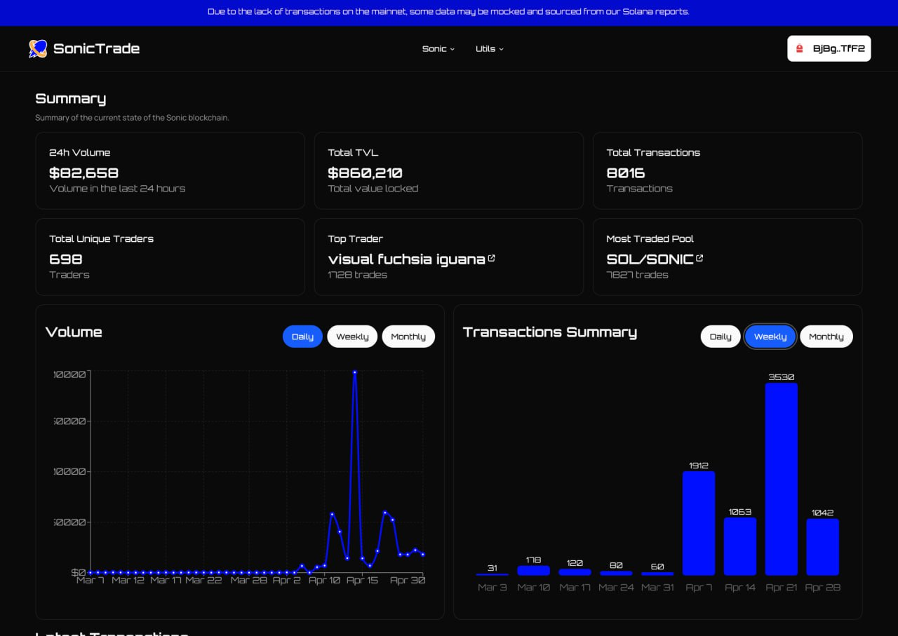
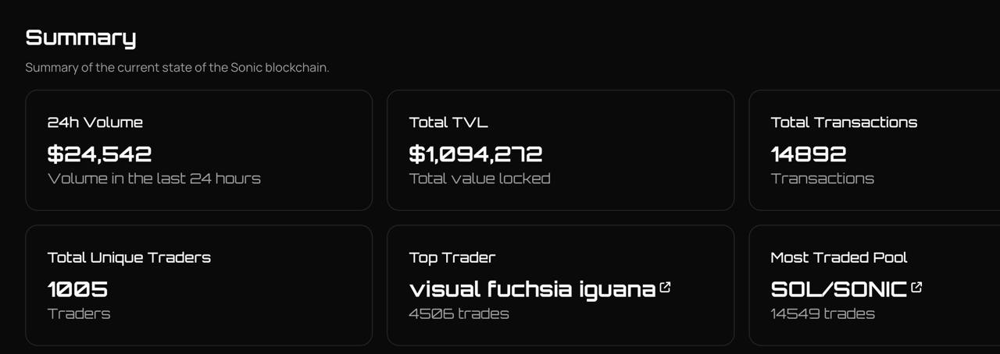
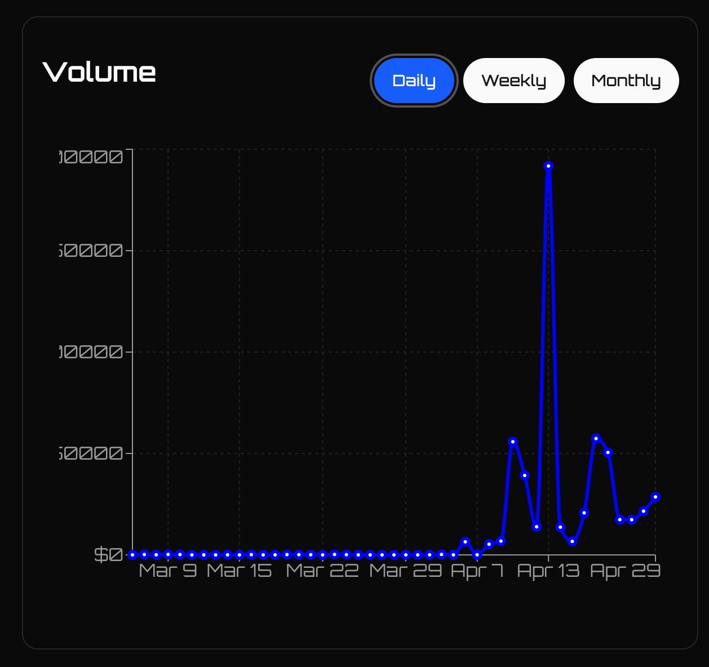

# SonicTrade

> 🥉 **3rd place, AI track - Sonic Mobius Hackathon**

An all-in-one trading platform for **Sonic SVM** - trading bots, AI-assisted strategies, backtesting, and live on-chain analytics in one place.

## What it does

- **Trading bots** - copy trade (mirror top traders), token sniping (catch new tokens at launch), AFK hands-free auto-trading, automated limit / market orders
- **AI + backtesting** - AI-assisted strategy creation, tested against historical on-chain data before going live
- **On-chain analytics** - live volume, TVL, transactions, top traders and most-traded pools on Sonic
- **MEV protection** - real-time alerts on sandwich attacks and other risks, with swap-setting adjustments to reduce exposure

## Screens

| Dashboard | Summary |
|---|---|
|  |  |

## Tech

- **Backend:** Rust - ultra-fast execution (sub-5ms)
- **Infra:** gRPC for scalable communication across the platform
- **Frontend:** Next.js, TypeScript

## Achievement

**3rd place - AI track**, Sonic Mobius Hackathon (2025). Described by the organizers as "the trading platform powered by data intelligence and AI assistance".

## My role

Built by a team of two under the name Chain Bros. I owned the entire frontend and the integration.

## Status

Hackathon build - some analytics data is mocked / sourced from Solana reports (noted in-app). Source code kept private; this repo is a case study.
